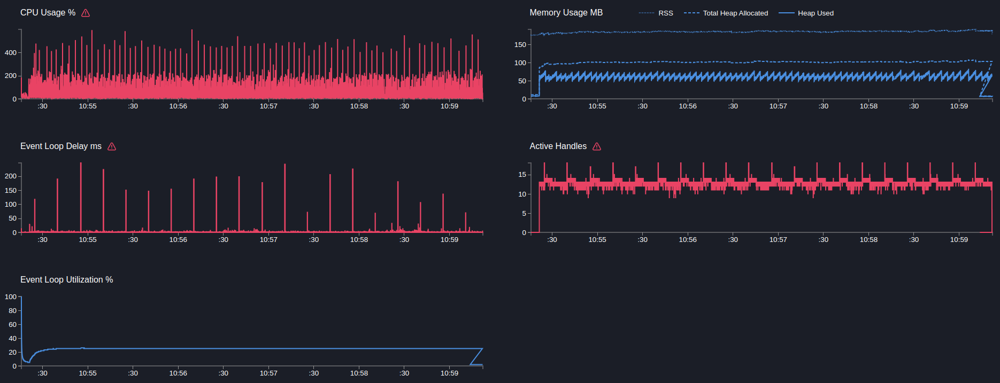

# Gateway + User service

## GET http/users/:id

```text
Telemetry: on
Mock timeout: 50ms
```

---

```bash
  clinic doctor --on-port 'sleep 5 && autocannon -m POST localhost:3103/http/users -c 5 -p 1 -d 300' -- node dist/src/main.js
```
[14018.clinic-doctor.html](../../gateway/.clinic/14018.clinic-doctor.html)



#### Latency
| Stat    | 2.5%  | 50%   | 97.5% | 99%    | Avg      | Stdev   | Max   |
|---------|-------|-------|-------|--------|---------|---------|-------|
| Latency | 59 ms | 64 ms | 83 ms | 110 ms | 66.13 ms | 22.1 ms | 900 ms |

#### Requests per Second
| Stat      | 1%  | 2.5% | 50%  | 97.5% | Avg    | Stdev | Min |
|-----------|-----|------|------|-------|--------|-------|-----|
| Req/Sec   | 41  | 57   | 76   | 81    | 75.04  | 7.11  | 16  |

#### Bytes per Second
| Stat      | 1%     | 2.5%   | 50%    | 97.5%  | Avg    | Stdev  | Min    |
|-----------|--------|--------|--------|--------|--------|--------|--------|
| Bytes/Sec | 18.7 kB | 25.9 kB | 34.6 kB | 36.9 kB | 34.1 kB | 3.23 kB | 7.28 kB |

23k requests in 300.97s, 10.2 MB read

---

Вывод:
