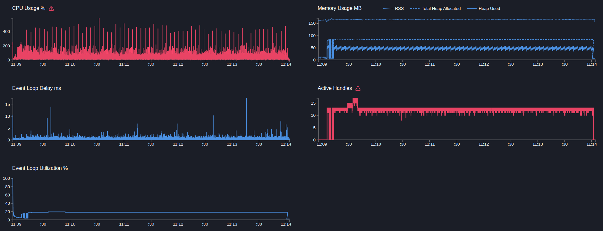

# Gateway + User service

## GET http/users/:id

```text
Telemetry: off
Mock timeout: 50ms
```

---

```bash
  clinic doctor --on-port 'sleep 5 && autocannon -m POST localhost:3103/http/users -c 5 -p 1 -d 300' -- node dist/src/main.js
```
[18547.clinic-doctor.html](../../gateway/.clinic/18547.clinic-doctor.html)



#### Latency
| Stat    | 2.5%  | 50%   | 97.5% | 99%   | Avg      | Stdev  | Max    |
|---------|-------|-------|-------|-------|----------|--------|--------|
| Latency | 57 ms | 60 ms | 67 ms | 78 ms | 60.93 ms | 5.7 ms | 251 ms |

#### Requests per Second
| Stat      | 1%  | 2.5% | 50%  | 97.5% | Avg    | Stdev | Min |
|-----------|-----|------|------|-------|--------|-------|-----|
| Req/Sec   | 68  | 75   | 81   | 85    | 81.38  | 2.87  | 61  |

#### Bytes per Second
| Stat      | 1%     | 2.5%   | 50%    | 97.5%  | Avg    | Stdev  | Min    |
|-----------|--------|--------|--------|--------|--------|--------|--------|
| Bytes/Sec | 27.8 kB | 30.7 kB | 33.2 kB | 34.8 kB | 33.3 kB | 1.17 kB | 24.9 kB |


24k requests in 300.53s, 9.98 MB read

---

Вывод:
