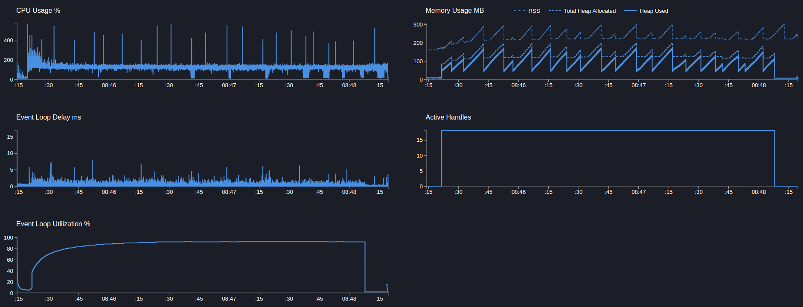
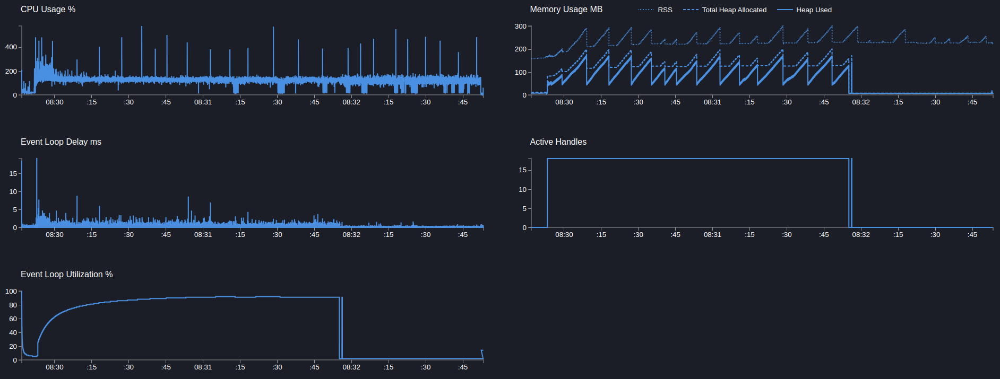
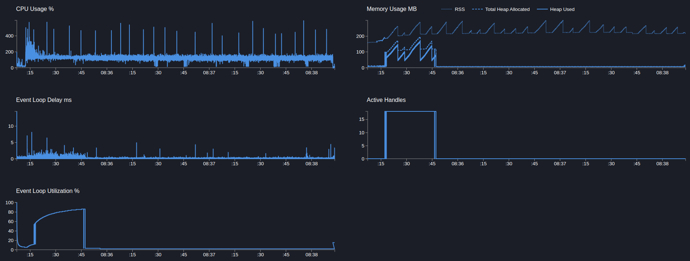

# User service

## POST users

> Создание пользователя, сайд эффект в виде публикацию в кафку события, запись доп метрики и логирование

```text
Telemetry: off
Telemetry sampling: off
```

---

```bash
  clinic doctor --on-port 'sleep 5 && autocannon -m POST localhost:3103/users -c 5 -p 1 -d 180' -- node dist/src/main.js
```

[26995.clinic-doctor.html](../../../user-service/.clinic/26995.clinic-doctor.html)



#### Latency
| Stat    | 2.5% | 50%  | 97.5% | 99%   | Avg     | Stdev  | Max    |
|---------|------|------|-------|-------|---------|--------|--------|
| Latency | 4 ms | 7 ms | 13 ms | 18 ms | 7.71 ms | 3.2 ms | 113 ms |

#### Requests per Second
| Stat      | 1%  | 2.5% | 50%  | 97.5% | Avg    | Stdev | Min |
|-----------|-----|------|------|-------|--------|-------|-----|
| Req/Sec   | 308 | 380  | 622  | 737   | 608.83 | 86.28 | 277 |

#### Bytes per Second
| Stat      | 1%     | 2.5%   | 50%    | 97.5%  | Avg    | Stdev   | Min    |
|-----------|--------|--------|--------|--------|--------|---------|--------|
| Bytes/Sec | 126 kB | 156 kB | 254 kB | 302 kB | 249 kB | 35.3 kB | 113 kB |

110k requests in 180.05s, 44.8 MB read


[23407.clinic-doctor.html](../../../user-service/.clinic/23407.clinic-doctor.html)

[24020.clinic-doctor.html](../../../user-service/.clinic/24020.clinic-doctor.html)





#### Latency
| Stat    | 2.5% | 50%  | 97.5% | 99%   | Avg    | Stdev   | Max   |
|---------|------|------|-------|-------|--------|---------|-------|
| Latency | 4 ms | 7 ms | 11 ms | 14 ms | 7.2 ms | 2.46 ms | 77 ms |

#### Requests per Second
| Stat      | 1%  | 2.5% | 50%  | 97.5% | Avg    | Stdev | Min |
|-----------|-----|------|------|-------|--------|-------|-----|
| Req/Sec   | 407 | 470  | 652  | 772   | 648.88 | 72    | 329 |

#### Bytes per Second
| Stat      | 1%     | 2.5%   | 50%    | 97.5%  | Avg    | Stdev   | Min    |
|-----------|--------|--------|--------|--------|--------|---------|--------|
| Bytes/Sec | 161 kB | 186 kB | 258 kB | 306 kB | 257 kB | 28.5 kB | 130 kB |

117k requests in 180.04s, 46.3 MB read

---

Вывод: хз
