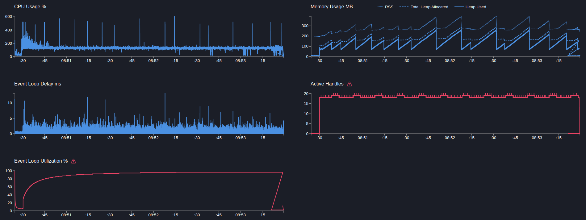

# User service

## POST users

> Создание пользователя, сайд эффект в виде публикацию в кафку события, запись доп метрики и логирование

```text
Telemetry: on
Telemetry sampling: 5%
Telemetry add metric: on
```

---

```bash
  clinic doctor --on-port 'sleep 5 && autocannon -m POST -b "{\"name\":\"name\"}" localhost:3103/users -c 5 -p 1 -d 180' -- node dist/src/main.js
```

[27655.clinic-doctor.html](../../../user-service/.clinic/27655.clinic-doctor.html)



#### Latency
| Stat    | 2.5% | 50%  | 97.5% | 99%   | Avg    | Stdev   | Max   |
|---------|------|------|-------|-------|--------|---------|-------|
| Latency | 7 ms | 11 ms | 18 ms | 21 ms | 11.57 ms | 3.17 ms | 102 ms |

#### Requests per Second
| Stat      | 1%  | 2.5% | 50%  | 97.5% | Avg    | Stdev | Min |
|-----------|-----|------|------|-------|--------|-------|-----|
| Req/Sec   | 285 | 321  | 417  | 478   | 414.03 | 39.44 | 224 |

#### Bytes per Second
| Stat      | 1%     | 2.5%   | 50%    | 97.5%  | Avg    | Stdev   | Min    |
|-----------|--------|--------|--------|--------|--------|---------|--------|
| Bytes/Sec | 117 kB | 131 kB | 171 kB | 196 kB | 169 kB | 16.1 kB | 91.6 kB |

75k requests in 180.05s, 30.5 MB read

---

Вывод: 
