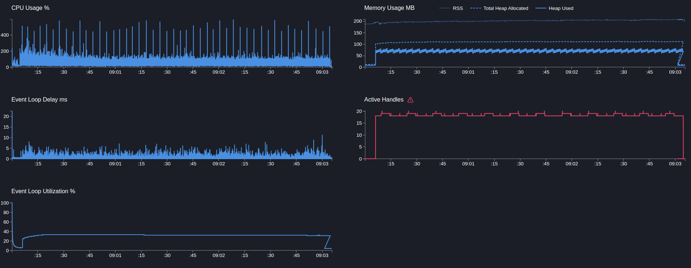

# User service

## POST users

> Создание пользователя, сайд эффект в виде публикацию в кафку события, запись доп метрики и логирование

```text
Telemetry: on
Telemetry sampling: 5%
Telemetry add metric: on
Mock timeout: 50ms
```

---

```bash
  clinic doctor --on-port 'sleep 5 && autocannon -m POST -b "{\"name\":\"name\"}" localhost:3103/users -c 5 -p 1 -d 180' -- node dist/src/main.js
```

[28523.clinic-doctor.html](../../../user-service/.clinic/28523.clinic-doctor.html)



#### Latency
| Stat    | 2.5%  | 50%   | 97.5% | 99%   | Avg      | Stdev   | Max    |
|---------|-------|-------|-------|-------|----------|---------|--------|
| Latency | 55 ms | 60 ms | 67 ms | 69 ms | 60.32 ms | 3.57 ms | 156 ms |

#### Requests per Second
| Stat      | 1%  | 2.5% | 50%  | 97.5% | Avg    | Stdev | Min |
|-----------|-----|------|------|-------|--------|-------|-----|
| Req/Sec   | 75  | 75   | 82   | 87    | 82.18  | 3.2   | 65  |

#### Bytes per Second
| Stat      | 1%      | 2.5%    | 50%     | 97.5%   | Avg     | Stdev   | Min     |
|-----------|---------|---------|---------|---------|---------|---------|---------|
| Bytes/Sec | 30.7 kB | 30.7 kB | 33.6 kB | 35.6 kB | 33.6 kB | 1.31 kB | 26.6 kB |

15k requests in 180.05s, 6.05 MB read

---

Вывод: 
