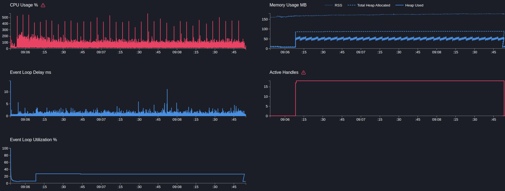

# User service

## POST users

> Создание пользователя, сайд эффект в виде публикацию в кафку события, запись доп метрики и логирование

```text
Telemetry: off
Mock timeout: 50ms
```

---

```bash
  clinic doctor --on-port 'sleep 5 && autocannon -m POST -b "{\"name\":\"name\"}" localhost:3103/users -c 5 -p 1 -d 180' -- node dist/src/main.js
```

[29110.clinic-doctor.html](../../../user-service/.clinic/29110.clinic-doctor.html)



| Stat    | 2.5%  | 50%   | 97.5% | 99%   | Avg     | Stdev   | Max   |
|---------|-------|-------|-------|-------|---------|---------|-------|
| Latency | 54 ms | 57 ms | 62 ms | 63 ms | 57.3 ms | 2.56 ms | 141 ms |

#### Requests per Second
| Stat      | 1%  | 2.5% | 50%  | 97.5% | Avg    | Stdev | Min |
|-----------|-----|------|------|-------|--------|-------|-----|
| Req/Sec   | 80  | 82   | 86   | 90    | 86.48  | 2.49  | 70  |

#### Bytes per Second
| Stat      | 1%     | 2.5%   | 50%    | 97.5%  | Avg    | Stdev  | Min    |
|-----------|--------|--------|--------|--------|--------|--------|--------|
| Bytes/Sec | 32.7 kB | 33.6 kB | 35.2 kB | 36.8 kB | 35.4 kB | 1.02 kB | 28.6 kB |

16k requests in 180.05s, 6.37 MB read

---

Вывод: 
