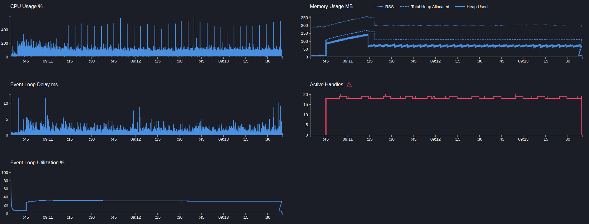

# User service

## POST users

> Создание пользователя, сайд эффект в виде публикацию в кафку события, запись доп метрики и логирование

```text
Telemetry: on
Telemetry sampling: 5%
Telemetry add metric: off
Telemetry instrumentation: 1
Mock timeout: 50ms
```

---

```bash
  clinic doctor --on-port 'sleep 5 && autocannon -m POST -b "{\"name\":\"name\"}" localhost:3103/users -c 5 -p 1 -d 180' -- node dist/src/main.js
```

[29628.clinic-doctor.html](../../../user-service/.clinic/29628.clinic-doctor.html)



#### Latency
| Stat    | 2.5%  | 50%   | 97.5% | 99%   | Avg     | Stdev   | Max   |
|---------|-------|-------|-------|-------|---------|---------|-------|
| Latency | 54 ms | 58 ms | 65 ms | 67 ms | 58.5 ms | 3.27 ms | 148 ms |

#### Requests per Second
| Stat      | 1%  | 2.5% | 50%  | 97.5% | Avg    | Stdev | Min |
|-----------|-----|------|------|-------|--------|-------|-----|
| Req/Sec   | 75  | 77   | 85   | 90    | 84.73  | 3.26  | 65  |

#### Bytes per Second
| Stat      | 1%     | 2.5%   | 50%    | 97.5%  | Avg    | Stdev  | Min    |
|-----------|--------|--------|--------|--------|--------|--------|--------|
| Bytes/Sec | 30.7 kB | 31.5 kB | 34.8 kB | 36.8 kB | 34.7 kB | 1.33 kB | 26.6 kB |

15k requests in 180.47s, 6.24 MB read

---

Вывод: 
