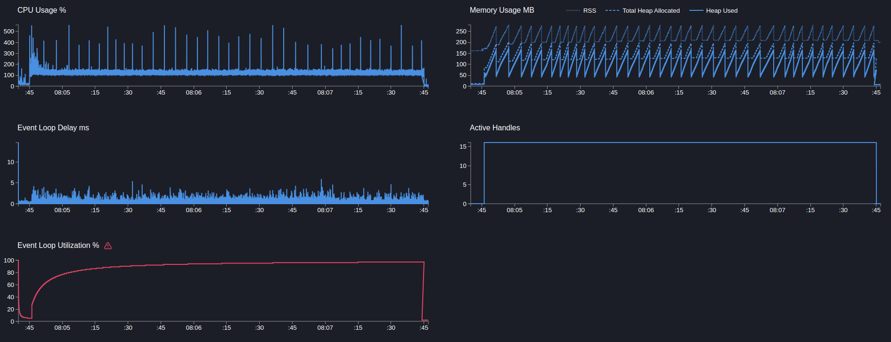
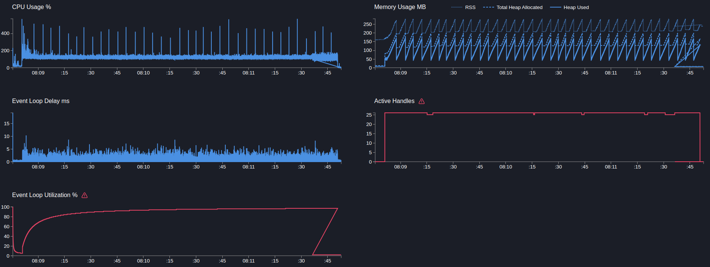

# User service

## GET users/:id

> Get запрос в бд получения по id

```text
Telemetry: off
Telemetry sampling: off
```

---

```bash
  clinic doctor --on-port 'sleep 5 && autocannon localhost:3103/users/91905f6b-bb5d-495c-b0ae-15b11d4aef6f -c 5 -p 1 -d 180' -- node dist/src/main.js
```

[20817.clinic-doctor.html](../../../user-service/.clinic/20817.clinic-doctor.html)



#### Latency
| Stat    | 2.5% | 50%  | 97.5% | 99%  | Avg     | Stdev   | Max   |
|---------|------|------|-------|------|---------|---------|-------|
| Latency | 1 ms | 3 ms | 5 ms  | 6 ms | 2.84 ms | 1.18 ms | 57 ms |

#### Requests per Second
| Stat      | 1%   | 2.5% | 50%  | 97.5% | Avg     | Stdev   | Min |
|-----------|------|------|------|-------|---------|---------|-----|
| Req/Sec   | 832  | 1,117 | 1,476 | 1,946 | 1,497.08 | 237.98 | 563 |

#### Bytes per Second
| Stat      | 1%     | 2.5%   | 50%    | 97.5%   | Avg    | Stdev   | Min    |
|-----------|--------|--------|--------|---------|--------|---------|--------|
| Bytes/Sec | 325 kB | 436 kB | 576 kB | 759 kB  | 584 kB | 92.8 kB | 220 kB |

269k requests in 180.03s, 105 MB read

---

```bash
  clinic doctor --on-port 'sleep 5 && autocannon localhost:3103/users/91905f6b-bb5d-495c-b0ae-15b11d4aef6f -c 10 -p 1 -d 180' -- node dist/src/main.js
```

[21212.clinic-doctor.html](../../../user-service/.clinic/21212.clinic-doctor.html)



#### Latency
| Stat    | 2.5% | 50%  | 97.5% | 99%   | Avg    | Stdev   | Max   |
|---------|------|------|-------|-------|--------|---------|-------|
| Latency | 3 ms | 6 ms | 11 ms | 13 ms | 6.2 ms | 2.15 ms | 89 ms |

#### Requests per Second
| Stat      | 1%   | 2.5%  | 50%  | 97.5% | Avg     | Stdev   | Min |
|-----------|------|-------|------|-------|---------|---------|-----|
| Req/Sec   | 981  | 1,233 | 1,479 | 1,909 | 1,492.4 | 168.94 | 668 |

#### Bytes per Second
| Stat      | 1%     | 2.5%   | 50%    | 97.5%  | Avg    | Stdev   | Min    |
|-----------|--------|--------|--------|--------|--------|---------|--------|
| Bytes/Sec | 383 kB | 481 kB | 577 kB | 745 kB | 582 kB | 65.9 kB | 261 kB |

269k requests in 180.04s, 105 MB read

---

Вывод: результат мало отличается от ping, слишком быстрая операция и даже на 5 коннектах сервер уже забивается
