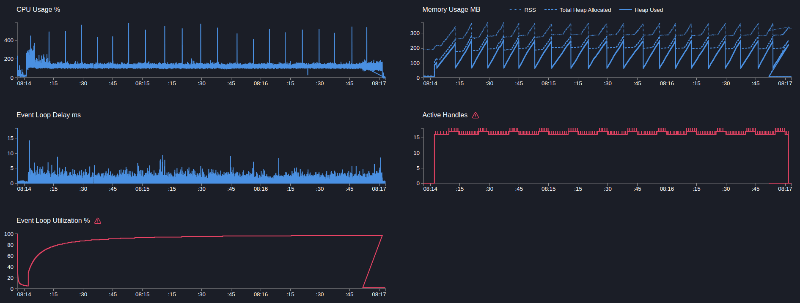
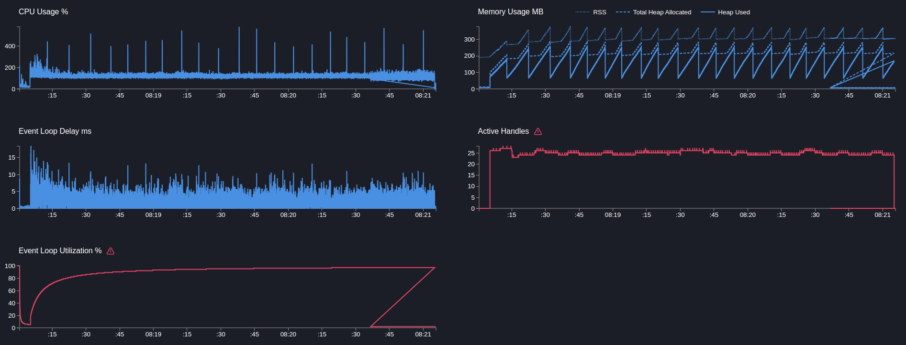

# User service

## GET users/:id

> Get запрос в бд получения по id

```text
Telemetry: on
Telemetry sampling: 5%
```

---

```bash
  clinic doctor --on-port 'sleep 5 && autocannon localhost:3103/users/91905f6b-bb5d-495c-b0ae-15b11d4aef6f -c 5 -p 1 -d 180' -- node dist/src/main.js
```

[21607.clinic-doctor.html](../../../user-service/.clinic/21607.clinic-doctor.html)



#### Latency
| Stat    | 2.5% | 50%  | 97.5% | 99%   | Avg    | Stdev  | Max   |
|---------|------|------|-------|-------|--------|--------|-------|
| Latency | 3 ms | 5 ms | 10 ms | 11 ms | 5.41 ms | 1.9 ms | 78 ms |

#### Requests per Second
| Stat      | 1%  | 2.5% | 50%  | 97.5% | Avg    | Stdev   | Min |
|-----------|-----|------|------|-------|--------|---------|-----|
| Req/Sec   | 589 | 641  | 845  | 1,044 | 845.05 | 108.97  | 444 |

#### Bytes per Second
| Stat      | 1%     | 2.5%   | 50%    | 97.5%  | Avg    | Stdev   | Min    |
|-----------|--------|--------|--------|--------|--------|---------|--------|
| Bytes/Sec | 230 kB | 250 kB | 330 kB | 407 kB | 330 kB | 42.5 kB | 173 kB |

152k requests in 180.52s, 59.3 MB read

---

```bash
  clinic doctor --on-port 'sleep 5 && autocannon localhost:3103/users/91905f6b-bb5d-495c-b0ae-15b11d4aef6f -c 10 -p 1 -d 180' -- node dist/src/main.js
```

[21936.clinic-doctor.html](../../../user-service/.clinic/21936.clinic-doctor.html)



#### Latency
| Stat    | 2.5% | 50%   | 97.5% | 99%   | Avg      | Stdev   | Max    |
|---------|------|-------|-------|-------|----------|---------|--------|
| Latency | 6 ms | 10 ms | 19 ms | 23 ms | 10.91 ms | 3.59 ms | 104 ms |

#### Requests per Second
| Stat      | 1%  | 2.5% | 50%  | 97.5% | Avg    | Stdev   | Min |
|-----------|-----|------|------|-------|--------|---------|-----|
| Req/Sec   | 470 | 530  | 878  | 1,090 | 875.9  | 126.69  | 414 |

#### Bytes per Second
| Stat      | 1%     | 2.5%   | 50%    | 97.5%  | Avg    | Stdev   | Min    |
|-----------|--------|--------|--------|--------|--------|---------|--------|
| Bytes/Sec | 183 kB | 207 kB | 343 kB | 425 kB | 342 kB | 49.4 kB | 161 kB |

158k requests in 180.04s, 61.5 MB read

---

Вывод: 
