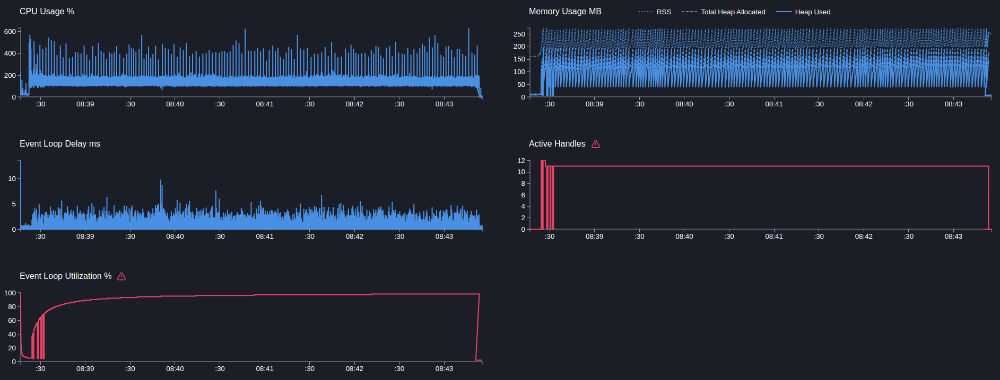
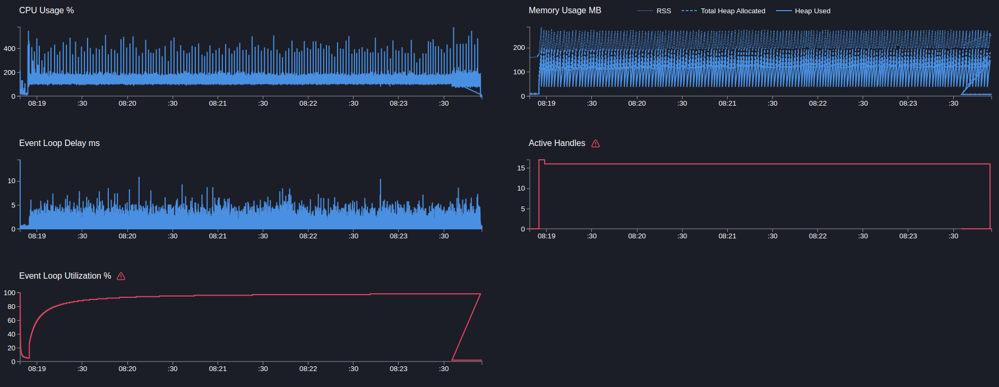
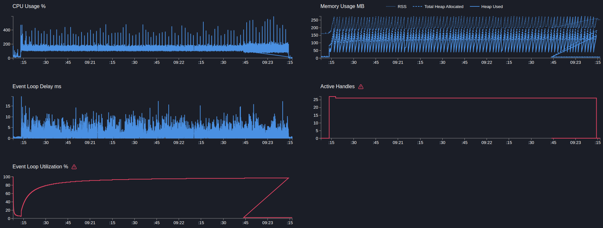

# User service

## GET users/ping

> Запрос возвращает статическую строку

```text
Telemetry: off
Mock timeout: off
```

---

```bash
  clinic doctor --on-port 'sleep 5 && autocannon localhost:3103/users/ping -c 5 -p 1 -d 300' -- node dist/src/main.js
```

[18376.clinic-doctor.html](../../../user-service/.clinic/18376.clinic-doctor.html)



#### Latency
| Stat    | 2.5% | 50%  | 97.5% | 99%  | Avg     | Stdev   | Max   |
|---------|------|------|-------|------|---------|---------|-------|
| Latency | 0 ms | 1 ms | 3 ms  | 4 ms | 0.71 ms | 0.88 ms | 19 ms |

#### Requests per Second
| Stat      | 1%    | 2.5%  | 50%    | 97.5%  | Avg      | Stdev  | Min    |
|-----------|-------|-------|--------|--------|----------|--------|--------|
| Req/Sec   | 2,787 | 2,979 | 3,951  | 5,167  | 3,965.69 | 591.63 | 1,727  |

#### Bytes per Second
| Stat      | 1%     | 2.5%   | 50%    | 97.5%  | Avg    | Stdev  | Min    |
|-----------|--------|--------|--------|--------|--------|--------|--------|
| Bytes/Sec | 650 kB | 694 kB | 921 kB | 1.2 MB | 924 kB | 138 kB | 402 kB |

1190k requests in 300.99s, 277 MB read

---

```bash
  clinic doctor --on-port 'sleep 5 && autocannon localhost:3103/users/ping -c 10 -p 1 -d 300' -- node dist/src/main.js
```

[16725.clinic-doctor.html](../../../user-service/.clinic/16725.clinic-doctor.html)



#### Latency
| Stat    | 2.5% | 50%  | 97.5% | 99%  | Avg     | Stdev   | Max   |
|---------|------|------|-------|------|---------|---------|-------|
| Latency | 1 ms | 2 ms | 5 ms  | 6 ms | 1.95 ms | 1.21 ms | 25 ms |

#### Requests per Second
| Stat      | 1%    | 2.5%  | 50%    | 97.5%   | Avg      | Stdev  | Min    |
|-----------|-------|-------|--------|---------|----------|--------|--------|
| Req/Sec   | 3,025 | 3,105 | 3,991  | 5,067   | 4,045.86 | 522.69 | 2,899  |

#### Bytes per Second
| Stat      | 1%     | 2.5%   | 50%    | 97.5%   | Avg    | Stdev  | Min    |
|-----------|--------|--------|--------|---------|--------|--------|--------|
| Bytes/Sec | 705 kB | 724 kB | 930 kB | 1.18 MB | 943 kB | 122 kB | 675 kB |

1214k requests in 300.44s, 283 MB read

---

```bash
    clinic doctor --on-port 'sleep 5 && autocannon localhost:3103/users/ping -c 20 -p 1 -d 180' -- node dist/src/main.js
```

[22620.clinic-doctor.html](../../../user-service/.clinic/22620.clinic-doctor.html)



#### Latency
| Stat    | 2.5% | 50%  | 97.5% | 99%   | Avg     | Stdev   | Max   |
|---------|------|------|-------|-------|---------|---------|-------|
| Latency | 3 ms | 4 ms | 10 ms | 11 ms | 4.69 ms | 1.97 ms | 29 ms |

#### Requests per Second
| Stat      | 1%    | 2.5%  | 50%    | 97.5%   | Avg      | Stdev  | Min    |
|-----------|-------|-------|--------|---------|----------|--------|--------|
| Req/Sec   | 2,861 | 3,131 | 3,865  | 4,699   | 3,849.57 | 460.95 | 2,104  |

#### Bytes per Second
| Stat      | 1%     | 2.5%   | 50%    | 97.5%   | Avg    | Stdev  | Min    |
|-----------|--------|--------|--------|---------|--------|--------|--------|
| Bytes/Sec | 667 kB | 730 kB | 901 kB | 1.09 MB | 897 kB | 107 kB | 490 kB |

693k requests in 181.07s, 161 MB read

---

Вывод: слишком быстрая операция, ивент луп начинает захлебываться уже на 5 коннектах, повышение коннектов ведет скорее к деградации. Достигнут предел.
