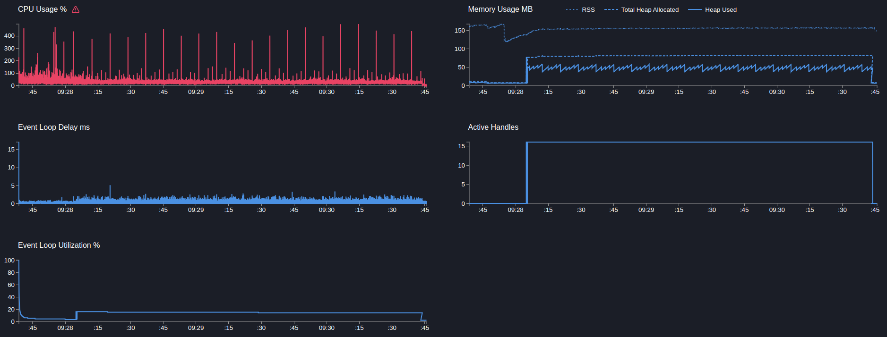

# User service

## GET users/ping

> Запрос возвращает статическую строку

```text
Telemetry: off
Mock timeout: 100ms
```

---

```bash
    clinic doctor --on-port 'sleep 5 && autocannon localhost:3103/users/ping -c 5 -p 1 -d 180' -- node dist/src/main.js
```

[23623.clinic-doctor.html](../../../user-service/.clinic/23623.clinic-doctor.html)



#### Latency
| Stat    | 2.5%   | 50%    | 97.5%  | 99%    | Avg      | Stdev   | Max    |
|---------|--------|--------|--------|--------|----------|---------|--------|
| Latency | 100 ms | 101 ms | 102 ms | 103 ms | 100.8 ms | 0.86 ms | 119 ms |

#### Requests per Second
| Stat      | 1%  | 2.5% | 50% | 97.5% | Avg   | Stdev | Min |
|-----------|-----|------|-----|-------|-------|-------|-----|
| Req/Sec   | 45  | 46   | 50  | 50    | 49.35 | 1.24  | 45  |

#### Bytes per Second
| Stat      | 1%      | 2.5%    | 50%     | 97.5%   | Avg     | Stdev | Min     |
|-----------|---------|---------|---------|---------|---------|-------|---------|
| Bytes/Sec | 10.5 kB | 10.7 kB | 11.7 kB | 11.7 kB | 11.5 kB | 289 B | 10.5 kB |

9k requests in 180.06s, 2.07 MB read

---

```bash
    clinic doctor --on-port 'sleep 5 && autocannon localhost:3103/users/ping -c 10 -p 1 -d 180' -- node dist/src/main.js
```

[24065.clinic-doctor.html](../../../user-service/.clinic/24065.clinic-doctor.html)


#### Latency
| Stat    | 2.5%   | 50%    | 97.5%  | 99%    | Avg       | Stdev   | Max    |
|---------|--------|--------|--------|--------|-----------|---------|--------|
| Latency | 100 ms | 101 ms | 102 ms | 103 ms | 100.82 ms | 0.88 ms | 123 ms |

#### Requests per Second
| Stat      | 1%  | 2.5% | 50% | 97.5% | Avg   | Stdev | Min |
|-----------|-----|------|-----|-------|-------|-------|-----|
| Req/Sec   | 94  | 95   | 99  | 100   | 98.65 | 1.58  | 90  |

#### Bytes per Second
| Stat      | 1%      | 2.5%    | 50%     | 97.5%   | Avg   | Stdev | Min   |
|-----------|---------|---------|---------|---------|-------|-------|-------|
| Bytes/Sec | 21.9 kB | 22.1 kB | 23.1 kB | 23.3 kB | 23 kB | 368 B | 21 kB |

18k requests in 181.01s, 4.14 MB read

---

Вывод: добавление задержки разгружает ивент луп, увеличение коннектов повышает производительность
