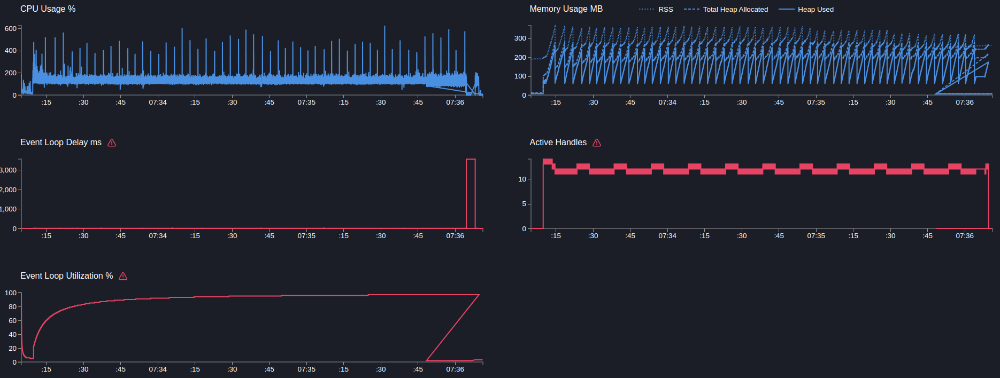
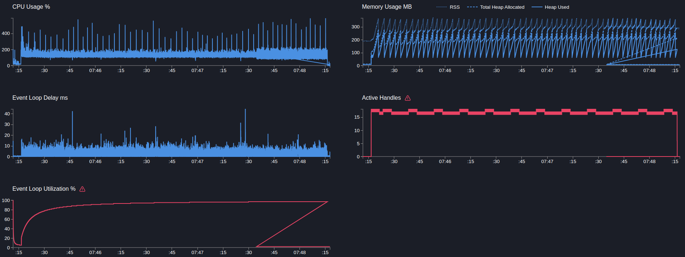

# User service

## GET users/ping

> Запрос возвращает статическую строку

```text
Telemetry: on
Telemetry sampling: off
Mock timeout: off
```

---

```bash
  clinic doctor --on-port 'sleep 5 && autocannon localhost:3103/users/ping -c 5 -p 1 -d 180' -- node dist/src/main.js
```

[12073.clinic-doctor.html](../../../user-service/.clinic/12073.clinic-doctor.html)



#### Latency
| Stat    | 2.5% | 50%  | 97.5% | 99%  | Avg     | Stdev    | Max     |
|---------|------|------|-------|------|---------|----------|---------|
| Latency | 1 ms | 2 ms | 7 ms  | 9 ms | 2.85 ms | 15.47 ms | 3570 ms |

#### Requests per Second
| Stat      | 1% | 2.5% | 50%  | 97.5% | Avg      | Stdev   | Min  |
|-----------|----|------|------|-------|----------|---------|------|
| Req/Sec   | 0  | 729  | 1,538 | 1,775 | 1,491.66 | 260.56 | 574  |

#### Bytes per Second
| Stat      | 1%  | 2.5%   | 50%    | 97.5%  | Avg    | Stdev   | Min     |
|-----------|-----|--------|--------|--------|--------|---------|---------|
| Bytes/Sec | 0 B | 170 kB | 358 kB | 414 kB | 348 kB | 60.7 kB | 134 kB |

269k requests in 180.05s, 62.6 MB read

---

```bash
  clinic doctor --on-port 'sleep 5 && autocannon localhost:3103/users/ping -c 10 -p 1 -d 180' -- node dist/src/main.js
```
[16909.clinic-doctor.html](../../../user-service/.clinic/16909.clinic-doctor.html)




markdown
Copy
Edit
#### Latency
| Stat    | 2.5% | 50%  | 97.5% | 99%   | Avg     | Stdev   | Max   |
|---------|------|------|-------|-------|---------|---------|-------|
| Latency | 3 ms | 6 ms | 13 ms | 15 ms | 6.42 ms | 2.89 ms | 69 ms |

#### Requests per Second
| Stat      | 1%    | 2.5%  | 50%   | 97.5% | Avg      | Stdev   | Min  |
|-----------|-------|-------|-------|-------|----------|---------|------|
| Req/Sec   | 1,069 | 1,114 | 1,432 | 1,794 | 1,442.92 | 181.88  | 859  |

#### Bytes per Second
| Stat      | 1%    | 2.5%  | 50%   | 97.5% | Avg    | Stdev   | Min     |
|-----------|-------|-------|-------|-------|--------|---------|---------|
| Bytes/Sec | 249 kB | 260 kB | 334 kB | 418 kB | 336 kB | 42.4 kB | 200 kB |

260k requests in 180.04s, 60.5 MB read

---

Вывод: С телеметрией производительность упала более чем в 2 раза. Но в мс это маленькое значение, далее посмотрим на более протяжительном запросе
