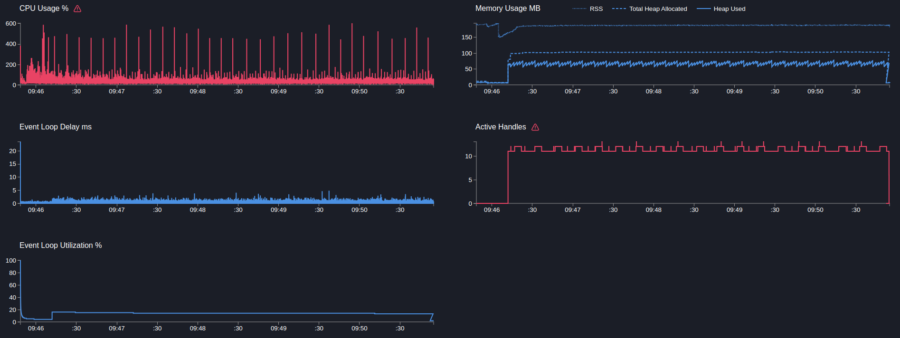
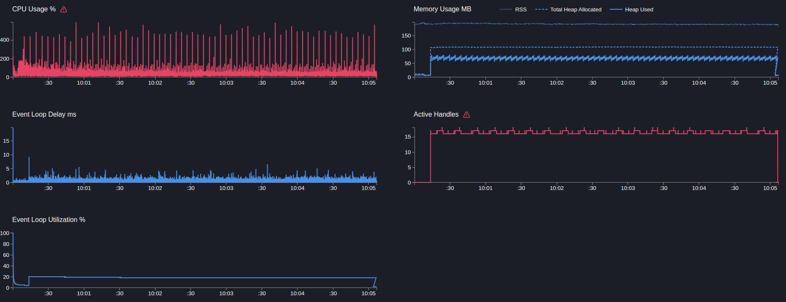

# User service

## GET users/ping

> Запрос возвращает статическую строку

```text
Telemetry: on
Telemetry sampling: 10%
Mock timeout: 100ms
```

---

```bash
  clinic doctor --on-port 'sleep 5 && autocannon localhost:3103/users/ping -c 5 -p 1 -d 300' -- node dist/src/main.js
```

[25185.clinic-doctor.html](../../../user-service/.clinic/25185.clinic-doctor.html)



#### Latency
| Stat    | 2.5%   | 50%    | 97.5%  | 99%    | Avg       | Stdev   | Max    |
|---------|--------|--------|--------|--------|-----------|---------|--------|
| Latency | 100 ms | 101 ms | 103 ms | 104 ms | 101.26 ms | 0.88 ms | 121 ms |

#### Requests per Second
| Stat      | 1%  | 2.5% | 50% | 97.5% | Avg   | Stdev | Min |
|-----------|-----|------|-----|-------|-------|-------|-----|
| Req/Sec   | 45  | 45   | 50  | 50    | 49.14 | 1.59  | 45  |

#### Bytes per Second
| Stat      | 1%      | 2.5%    | 50%     | 97.5%   | Avg    | Stdev | Min      |
|-----------|---------|---------|---------|---------|--------|-------|----------|
| Bytes/Sec | 10.5 kB | 10.5 kB | 11.7 kB | 11.7 kB | 11.4 kB | 370 B | 10.5 kB |

15k requests in 301.48s, 3.43 MB read

---

```bash
  clinic doctor --on-port 'sleep 5 && autocannon localhost:3103/users/ping -c 10 -p 1 -d 300' -- node dist/src/main.js
```

[26250.clinic-doctor.html](../../../user-service/.clinic/26250.clinic-doctor.html)



#### Latency
| Stat    | 2.5%   | 50%    | 97.5%  | 99%    | Avg       | Stdev   | Max    |
|---------|--------|--------|--------|--------|-----------|---------|--------|
| Latency | 100 ms | 101 ms | 103 ms | 104 ms | 101.19 ms | 0.94 ms | 132 ms |

#### Requests per Second
| Stat      | 1%  | 2.5% | 50% | 97.5% | Avg   | Stdev | Min |
|-----------|-----|------|-----|-------|-------|-------|-----|
| Req/Sec   | 92  | 93   | 99  | 100   | 98.33 | 2.09  | 90  |

#### Bytes per Second
| Stat      | 1%      | 2.5%    | 50%     | 97.5%   | Avg    | Stdev | Min     |
|-----------|---------|---------|---------|---------|--------|-------|---------|
| Bytes/Sec | 21.4 kB | 21.7 kB | 23.1 kB | 23.3 kB | 22.9 kB | 487 B | 21 kB |

30k requests in 301.48s, 6.87 MB read

---

Вывод: 
