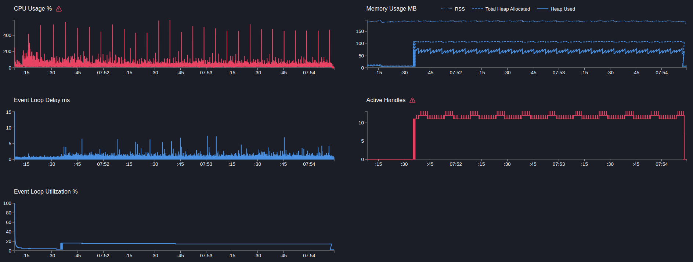
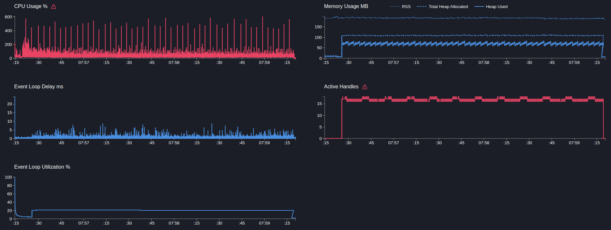

# User service

## GET users/ping

> Запрос возвращает статическую строку

```text
Telemetry: on
Telemetry sampling: off
Mock timeout: 100ms
```

---

```bash
  clinic doctor --on-port 'sleep 5 && autocannon localhost:3103/users/ping -c 5 -p 1 -d 180' -- node dist/src/main.js
```

[19609.clinic-doctor.html](../../../user-service/.clinic/19609.clinic-doctor.html)



#### Latency
| Stat    | 2.5%   | 50%    | 97.5%  | 99%    | Avg       | Stdev   | Max    |
|---------|---------|--------|--------|--------|-----------|---------|--------|
| Latency | 100 ms | 101 ms | 104 ms | 106 ms | 101.43 ms | 1.23 ms | 132 ms |

#### Requests per Second
| Stat      | 1%   | 2.5% | 50% | 97.5% | Avg   | Stdev | Min |
|-----------|------|------|-----|-------|-------|-------|-----|
| Req/Sec   | 45   | 45   | 50  | 50    | 49.05 | 1.54  | 45  |

#### Bytes per Second
| Stat      | 1%     | 2.5%   | 50%    | 97.5%  | Avg     | Stdev  | Min     |
|-----------|--------|--------|--------|--------|---------|--------|---------|
| Bytes/Sec | 10.5 kB | 10.5 kB | 11.7 kB | 11.7 kB | 11.4 kB | 358 B  | 10.5 kB |

9k requests in 180.06s, 2.06 MB read

---

```bash
  clinic doctor --on-port 'sleep 5 && autocannon localhost:3103/users/ping -c 10 -p 1 -d 180' -- node dist/src/main.js
```

[19953.clinic-doctor.html](../../../user-service/.clinic/19953.clinic-doctor.html)



#### Latency
| Stat    | 2.5%   | 50%    | 97.5%  | 99%    | Avg       | Stdev  | Max    |
|---------|---------|--------|--------|--------|-----------|--------|--------|
| Latency | 100 ms | 101 ms | 104 ms | 106 ms | 101.37 ms | 1.3 ms | 133 ms |

#### Requests per Second
| Stat      | 1%   | 2.5% | 50% | 97.5% | Avg   | Stdev | Min |
|-----------|------|------|-----|-------|-------|-------|-----|
| Req/Sec   | 93   | 94   | 98  | 100   | 98.15 | 1.83  | 90  |

#### Bytes per Second
| Stat      | 1%      | 2.5%    | 50%     | 97.5%   | Avg     | Stdev  | Min     |
|-----------|---------|---------|---------|---------|---------|--------|---------|
| Bytes/Sec | 21.7 kB | 21.9 kB | 22.8 kB | 23.3 kB | 22.9 kB | 426 B  | 21 kB   |

18k requests in 180.07s, 4.12 MB read

---

Вывод: снижение нагрузки за счет сэмплирования не замечено, скорее наоборот подрастает цпу так как добавляется доп код. Влияет только на обьем хранимых трейсов
